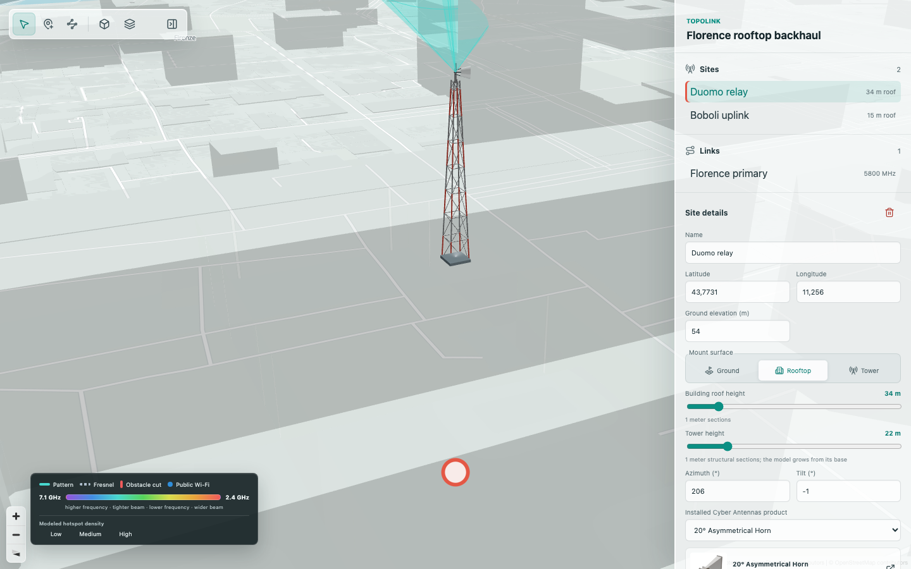
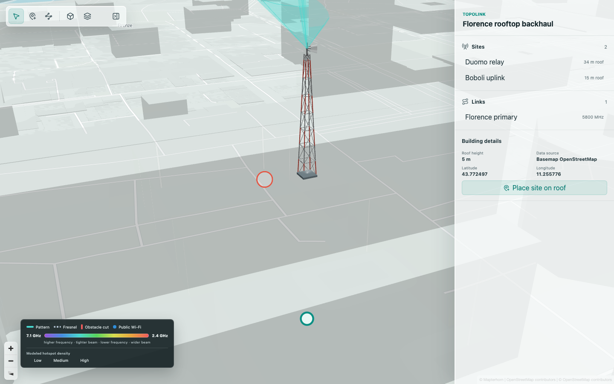
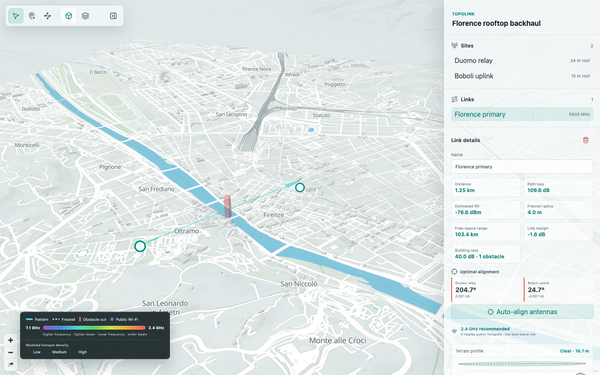

# TopoLink

TopoLink is a reusable React component for planning point-to-point RF links on a 3D MapLibre map. It combines PMTiles vector data, Terrain-RGB elevation, basemap building extrusion, Three.js towers and antennas, and an inline JavaScript Web Worker for RF calculations.

The project is currently a pre-release `0.1.0` workspace. The package builds locally, but it has not yet been published to npm and the GitHub release workflow is still a TODO. There is no WebAssembly or native runtime dependency.



| Rooftop building selection | Height-aware obstruction analysis |
| --- | --- |
|  |  |

## What works now

- Full-size, embeddable React planner with responsive desktop and mobile layouts.
- MapLibre 6 map using PMTiles, Terrain-RGB, terrain, and extruded buildings from the basemap vector source.
- Three.js tower, mounting structure, antenna housing, RF pattern, Fresnel volume, link centerline, and obstacle cuts.
- Ground, rooftop, and tower mounting modes with whole-meter structure heights and tested one-meter roof-grid geometry and snapping.
- Building, site, link, antenna, and obstacle selection with inspector details and contextual actions.
- Multi-site selection, link creation, reciprocal azimuth/elevation calculation, and automatic antenna alignment.
- RF link budget, free-space path loss, range, receive power, link margin, effective-earth curvature, terrain profile, and Fresnel clearance calculations.
- Height-aware OSM building checks along a selected path. Explicit heights are preferred; level-derived and type-derived heights are identified as estimates.
- Building diffraction loss included in receive power and link margin when a footprint penetrates the configured Fresnel clearance.
- Optional OSM public Wi-Fi observations and modeled density overlay. Both are disabled by default.
- A packaged 24-item Cyber Antennas catalog with product images and technical fields.
- Local workspace, layer state, and OSM response caching with validation and fallback error handling.

## Workspace

```text
apps/demo/              Full-viewport interactive preview
packages/link-planner/  Public React package, RF engine, map adapters, UI, assets, and tests
fixtures/               Versioned workspace fixtures
tests/e2e/              Desktop and mobile Playwright coverage
docs/                   Audit notes and current-build screenshots
scripts/                Dependency and packaging diagnostics
```

## Data sources

The current demo uses these online sources:

- Vector map: `https://pmtiles.io/protomaps(vector)ODbL_firenze.pmtiles`
- Terrain: `https://tiles.mapterhorn.com/tilejson.json`
- Detailed buildings along active links: OpenStreetMap through Overpass, cached in `localStorage`

No local `casablanca.pmtiles` file is required to run the current demo. The Florence PMTiles archive is regional, however, so it does not cover Casablanca or arbitrary locations. The reusable component therefore keeps `mapDataUrl` and `terrainDataUrl` as required host configuration instead of silently coupling every integration to the Florence demo.

Production applications should provide suitable regional or global PMTiles and terrain endpoints, with availability and usage terms appropriate for their deployment. PMTiles building features provide immediate rendering and fallback analysis. Overpass details refine active-link footprints and height metadata when the public service is available.

## Requirements

- Node.js 22.12 or newer
- npm 10 or newer
- React and React DOM 18.3 through 19 as host peer dependencies

Install and validate the workspace:

```sh
npm install
npm run deps:check
npm run check
```

Start the demo:

```sh
npm run dev
```

Run the browser tests after installing Playwright Chromium:

```sh
npx playwright install chromium
npm run test:e2e
```

The current dependency and packaging audit is recorded in [`docs/dependency-status.md`](docs/dependency-status.md).

## Package installation

Until the first npm release, build the repository and install the local package path from a consuming project:

```sh
npm run build
```

```sh
npm install ../TopoLink/packages/link-planner
# or
pnpm add ../TopoLink/packages/link-planner
# or
bun add ../TopoLink/packages/link-planner
```

After publication, the equivalent commands will be:

```sh
npm install @cyberantennas/topo-link-planner
pnpm add @cyberantennas/topo-link-planner
bun add @cyberantennas/topo-link-planner
```

## React usage

```tsx
import {
  LinkPlanner,
  type LinkPlannerWorkspace,
} from '@cyberantennas/topo-link-planner';
import '@cyberantennas/topo-link-planner/styles.css';

const workspace: LinkPlannerWorkspace = loadWorkspaceForYourRegion();

export function PlannerPage() {
  return (
    <div style={{ width: '100%', height: '100dvh' }}>
      <LinkPlanner
        initialWorkspace={workspace}
        mapDataUrl="https://pmtiles.io/protomaps(vector)ODbL_firenze.pmtiles"
        terrainDataUrl="https://tiles.mapterhorn.com/tilejson.json"
        onError={(error) => console.error('TopoLink:', error)}
      />
    </div>
  );
}
```

Replace the Florence map URL when the workspace is outside Florence. The component fills its parent, so each ancestor up to the intended layout boundary must have a definite width and height.

## Next.js App Router

MapLibre, Three.js, workers, and WebGL require a browser. Render the planner through a client component with server-side rendering disabled.

Import the package stylesheet once from `app/layout.tsx`:

```tsx
import '@cyberantennas/topo-link-planner/styles.css';
import type { ReactNode } from 'react';

export default function RootLayout({ children }: { children: ReactNode }) {
  return (
    <html lang="en">
      <body>{children}</body>
    </html>
  );
}
```

Create a client wrapper such as `components/topolink-planner.tsx`:

```tsx
'use client';

import dynamic from 'next/dynamic';
import type { LinkPlannerWorkspace } from '@cyberantennas/topo-link-planner';

const LinkPlanner = dynamic(
  () => import('@cyberantennas/topo-link-planner').then((module) => module.LinkPlanner),
  { ssr: false },
);

interface TopoLinkPlannerProps {
  workspace: LinkPlannerWorkspace;
}

export function TopoLinkPlanner({ workspace }: TopoLinkPlannerProps) {
  const mapDataUrl = process.env.NEXT_PUBLIC_TOPOLINK_MAP_URL;
  const terrainDataUrl = process.env.NEXT_PUBLIC_TOPOLINK_TERRAIN_URL;

  if (!mapDataUrl || !terrainDataUrl) {
    return <p>TopoLink map sources are not configured.</p>;
  }

  return (
    <div style={{ width: '100%', height: '100dvh' }}>
      <LinkPlanner
        initialWorkspace={workspace}
        mapDataUrl={mapDataUrl}
        terrainDataUrl={terrainDataUrl}
      />
    </div>
  );
}
```

Configure the public source URLs in `.env.local`:

```dotenv
NEXT_PUBLIC_TOPOLINK_MAP_URL=https://pmtiles.io/protomaps(vector)ODbL_firenze.pmtiles
NEXT_PUBLIC_TOPOLINK_TERRAIN_URL=https://tiles.mapterhorn.com/tilejson.json
```

The package keeps MapLibre and PMTiles imports lazy for CommonJS and server import compatibility, but the rendered planner must still remain inside a Next.js client boundary.

## State and calculations

The default workspace codec uses a `topolink-json-v1:` Base64-prefixed JSON payload. It is a development format, not Protobuf. `WorkspaceCodec` is injectable so a future generated Protobuf codec can replace it without changing the planner API.

RF calculations run in an inline JavaScript Web Worker. The selected path uses terrain sampling plus basemap/OSM building geometry. The visible link line is placed through the center of the antenna beam between installed antenna elevations. Buildings are considered obstacles only when their roof elevation penetrates the required Fresnel clearance. A single knife-edge model currently converts that penetration into additional loss.

## Build outputs

The current library build creates:

```text
dist/index.js                    ESM package entry
dist/index.cjs                   CommonJS package entry
dist/types/                      TypeScript declarations
dist/topo-link-planner.css       Component styles
dist/assets/                     Product and runtime assets
```

Vite minifies production JavaScript, but the project does not yet emit separately named `.js` and `.min.js` release downloads.

## Release plan

The planned tag-triggered GitHub Actions release will:

1. Install with the lockfile and run dependency, type, unit, build, browser, CommonJS import, and package dry-run checks.
2. Build versioned ESM `.js` and compressed `.min.js` browser artifacts, CSS, source maps, declarations, and an npm `.tgz` package.
3. Generate SHA-256 checksums and attach the artifacts to the GitHub Release.
4. Publish `@cyberantennas/topo-link-planner` to npm with provenance after all checks pass.

Package-manager installation is the recommended integration because it resolves React peer dependencies, CSS, declarations, and product assets. The future direct `.js` download will be an ESM distribution, not a self-contained replacement for React and React DOM.

## Verified status

- [x] Reusable React component and full-viewport demo
- [x] PMTiles, Terrain-RGB, terrain, and basemap 3D buildings
- [x] JavaScript worker RF engine with no WASM
- [x] 3D tower, antenna, beam, Fresnel zone, and centered link line
- [x] Ground, rooftop, and tower mounting modes
- [x] One-meter roof-grid geometry and placement snapping unit tests
- [x] Building/site/link selection, multi-select, context actions, and link creation
- [x] Reciprocal azimuth/elevation calculations and auto-alignment
- [x] Link budget, range, terrain, curvature, and Fresnel calculations
- [x] Height-aware OSM obstruction checks and diffraction loss in the budget
- [x] Public Wi-Fi layers disabled by default
- [x] Local storage persistence, validation, cache, and service fallbacks
- [x] ESM, CommonJS, declarations, CSS, and product asset builds
- [x] 32 unit tests and two desktop/mobile Playwright scenarios
- [x] Dependency audit with zero known vulnerabilities

## TODO

### RF and geospatial accuracy

- [ ] Verify every product's azimuth/elevation 3 dB or 6 dB beamwidth, gain pattern, sensitivity, and supported frequency against manufacturer data sheets.
- [ ] Add multiple-obstacle diffraction and material-aware attenuation models.
- [ ] Validate terrain, building heights, beam geometry, and calculated budgets against surveyed links and field measurements.
- [ ] Add deterministic licensed PMTiles and Terrain-RGB browser fixtures for fully offline tests.
- [ ] Improve complex and multipolygon rooftop grid clipping and verify it visually across representative buildings.

### Component quality

- [ ] Complete keyboard navigation and screen-reader interaction audits.
- [ ] Profile map startup, Three.js rendering, and code splitting on low-power mobile devices.
- [ ] Replace the development Base64 JSON codec with a versioned Protobuf schema and migrations.
- [ ] Add host-configurable Overpass endpoints, retry policy, and cache controls.
- [ ] Replace procedural product housings with licensed manufacturer 3D models where available.

### Distribution

- [ ] Add the GitHub Actions release and npm provenance workflow.
- [ ] Emit versioned `.js`, `.min.js`, CSS, source-map, declaration, checksum, and `.tgz` artifacts.
- [ ] Publish the package and verify npm, pnpm, bun, Next.js, Vite, and CommonJS consumer examples in CI.
- [ ] Add versioning policy, changelog, release notes, and a project license.

## Known limitations

- The public demo map is limited to Florence and depends on third-party online services without a project-owned availability guarantee.
- OSM buildings can lack reliable height tags. Estimated heights are labeled, but they are not survey-grade measurements.
- The current obstruction model uses one knife edge and does not yet model facade material, reflections, vegetation, weather, or multi-path effects.
- Public Wi-Fi data is optional OpenStreetMap metadata and the heatmap is modeled density, not live spectrum telemetry.
- Product geometry is procedural and uses transparent image skins; it is not yet manufacturer-supplied GLTF geometry.
- The one-meter rooftop grid logic is unit tested, but complex roof shapes still need broader visual regression coverage.

## Validation snapshot

As of 2026-08-24:

- `npm run deps:check` passes.
- `npm run check` passes strict type checking, 32 unit tests, and ESM/CommonJS/demo builds.
- `npm run test:e2e` passes two desktop and mobile Playwright scenarios.
- The package CommonJS import smoke test and npm tarball dry run pass.
- `npm audit --audit-level=high` reports zero vulnerabilities.

No project license has been selected yet.
